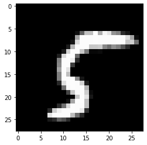
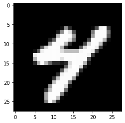
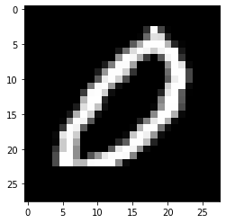
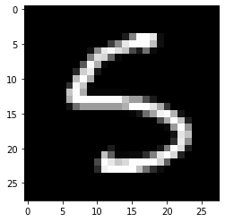

We start by mounting our drive folder so that we can access our data.


```python
from google.colab import drive
drive.mount('/content/drive', force_remount=True)
```

    Mounted at /content/drive
    


```python
!pip install opencv-python -U
!pip install umap-learn
```

    Requirement already satisfied: opencv-python in /usr/local/lib/python3.7/dist-packages (4.1.2.30)
    Collecting opencv-python
      Downloading opencv_python-4.5.5.64-cp36-abi3-manylinux_2_17_x86_64.manylinux2014_x86_64.whl (60.5 MB)
         |████████████████████████████████| 60.5 MB 1.2 MB/s 
    [?25hRequirement already satisfied: numpy>=1.14.5 in /usr/local/lib/python3.7/dist-packages (from opencv-python) (1.21.5)
    Installing collected packages: opencv-python
      Attempting uninstall: opencv-python
        Found existing installation: opencv-python 4.1.2.30
        Uninstalling opencv-python-4.1.2.30:
          Successfully uninstalled opencv-python-4.1.2.30
    ERROR: pip's dependency resolver does not currently take into account all the packages that are installed. This behaviour is the source of the following dependency conflicts.
    albumentations 0.1.12 requires imgaug<0.2.7,>=0.2.5, but you have imgaug 0.2.9 which is incompatible.
    Successfully installed opencv-python-4.5.5.64
    Collecting umap-learn
      Downloading umap-learn-0.5.2.tar.gz (86 kB)
         |████████████████████████████████| 86 kB 3.6 MB/s 
    [?25hRequirement already satisfied: numpy>=1.17 in /usr/local/lib/python3.7/dist-packages (from umap-learn) (1.21.5)
    Requirement already satisfied: scikit-learn>=0.22 in /usr/local/lib/python3.7/dist-packages (from umap-learn) (1.0.2)
    Requirement already satisfied: scipy>=1.0 in /usr/local/lib/python3.7/dist-packages (from umap-learn) (1.4.1)
    Requirement already satisfied: numba>=0.49 in /usr/local/lib/python3.7/dist-packages (from umap-learn) (0.51.2)
    Collecting pynndescent>=0.5
      Downloading pynndescent-0.5.6.tar.gz (1.1 MB)
         |████████████████████████████████| 1.1 MB 51.4 MB/s 
    [?25hRequirement already satisfied: tqdm in /usr/local/lib/python3.7/dist-packages (from umap-learn) (4.63.0)
    Requirement already satisfied: setuptools in /usr/local/lib/python3.7/dist-packages (from numba>=0.49->umap-learn) (57.4.0)
    Requirement already satisfied: llvmlite<0.35,>=0.34.0.dev0 in /usr/local/lib/python3.7/dist-packages (from numba>=0.49->umap-learn) (0.34.0)
    Requirement already satisfied: joblib>=0.11 in /usr/local/lib/python3.7/dist-packages (from pynndescent>=0.5->umap-learn) (1.1.0)
    Requirement already satisfied: threadpoolctl>=2.0.0 in /usr/local/lib/python3.7/dist-packages (from scikit-learn>=0.22->umap-learn) (3.1.0)
    Building wheels for collected packages: umap-learn, pynndescent
      Building wheel for umap-learn (setup.py) ... [?25l[?25hdone
      Created wheel for umap-learn: filename=umap_learn-0.5.2-py3-none-any.whl size=82708 sha256=a757334ac18f9ff683c0cc10dce3a9f58940cd601406e2676118f7d7bc67843c
      Stored in directory: /root/.cache/pip/wheels/84/1b/c6/aaf68a748122632967cef4dffef68224eb16798b6793257d82
      Building wheel for pynndescent (setup.py) ... [?25l[?25hdone
      Created wheel for pynndescent: filename=pynndescent-0.5.6-py3-none-any.whl size=53943 sha256=09264ad8b1b0b0b61a6ccbad208d1b07f3e0714bec00b90a22fe97990b52365d
      Stored in directory: /root/.cache/pip/wheels/03/f1/56/f80d72741e400345b5a5b50ec3d929aca581bf45e0225d5c50
    Successfully built umap-learn pynndescent
    Installing collected packages: pynndescent, umap-learn
    Successfully installed pynndescent-0.5.6 umap-learn-0.5.2
    

This mnist is already in the format of class/image.png


```python
!unzip "/content/drive/MyDrive/mnist.zip"
```

    Archive:  /content/drive/MyDrive/mnist.zip
    replace mnist/train/0/1000.png? [y]es, [n]o, [A]ll, [N]one, [r]ename: N
    


The general structure of what we want to do is something like:

- Load the train and test images
- Extract some descriptors from all images. Here we are going to use an algorithm called SIFT/ORF
- Generate visual words by applying k-means to the SIFT/ORF descriptors of the train data
- Extract an histogram of the visual words from train and test data (effectively generating our features)
- Training a ML algorithm
- Apply it to test data and evaluate 


```python
import os  # OS, dealing with file stuff, OS
import cv2  # opencv, images library
import numpy as np # vector, matrices
from tqdm import tqdm # progress bar
from pathlib import Path # path-related stuff
import matplotlib.pyplot as plt # plotting
import umap  # T-SNE / UMAP
import pandas as pd # dataframes
import seaborn as sns  # plotting
from sklearn.svm import SVC # svm
from sklearn.ensemble import RandomForestClassifier # random forest
from sklearn.metrics import accuracy_score  # just accuracy
```


```python
# let's start by loading data
def load_imgs(folder, grayscale=True):
    images = []
    for f in tqdm(os.listdir(folder)):      
        f = os.path.join(folder, f)
        img = cv2.imread(f, 3)
        # convert to grayscale
        if grayscale:
            img = cv2.cvtColor(img, cv2.COLOR_BGR2GRAY)
        else:
            img = cv2.cvtColor(img, cv2.COLOR_BGR2RGB)
        images.append(img)
    return images

base_folder = Path('mnist')

train_imgs = [
    (img, y)
    for y in os.listdir(base_folder / 'train')
    for img in load_imgs(base_folder / 'train' / y)[:100]
]  # list comprehension

# train_imgs = []
# for y in os.listdir(base_folder / 'train'):
#     for img in load_imgs(base_folder / 'train' / y)[:100]:
#         train_imgs.append((img, y))


test_imgs = [
    (img, y)
    for y in os.listdir(base_folder / 'valid')
    for img in load_imgs(base_folder / 'valid' / y)[:100]
]
```

    100%|██████████| 5421/5421 [00:00<00:00, 14887.15it/s]
    100%|██████████| 5851/5851 [00:00<00:00, 14800.90it/s]
    100%|██████████| 5923/5923 [00:00<00:00, 16253.21it/s]
    100%|██████████| 5918/5918 [00:00<00:00, 15384.86it/s]
    100%|██████████| 5958/5958 [00:00<00:00, 15706.34it/s]
    100%|██████████| 6742/6742 [00:00<00:00, 16415.48it/s]
    100%|██████████| 5949/5949 [00:00<00:00, 14363.61it/s]
    100%|██████████| 6265/6265 [00:00<00:00, 16307.49it/s]
    100%|██████████| 6131/6131 [00:00<00:00, 15900.81it/s]
    100%|██████████| 5842/5842 [00:00<00:00, 15615.22it/s]
    100%|██████████| 892/892 [00:00<00:00, 16339.21it/s]
    100%|██████████| 974/974 [00:00<00:00, 16007.79it/s]
    100%|██████████| 980/980 [00:00<00:00, 15935.62it/s]
    100%|██████████| 958/958 [00:00<00:00, 12953.77it/s]
    100%|██████████| 1032/1032 [00:00<00:00, 12557.21it/s]
    100%|██████████| 1135/1135 [00:00<00:00, 17015.22it/s]
    100%|██████████| 1009/1009 [00:00<00:00, 16206.63it/s]
    100%|██████████| 1028/1028 [00:00<00:00, 17171.36it/s]
    100%|██████████| 1010/1010 [00:00<00:00, 15691.72it/s]
    100%|██████████| 982/982 [00:00<00:00, 16791.03it/s]
    


```python
print(len(train_imgs))
print(len(test_imgs))
print(train_imgs[0])
```


```python
plt.imshow(train_imgs[0][0], cmap='gray')
```


    <matplotlib.image.AxesImage at 0x7f69f93b0050>


    

    


```python
plt.imshow(train_imgs[999][0], cmap='gray')
```


    <matplotlib.image.AxesImage at 0x7f69efcf3ad0>


    

    


```python
plt.imshow(train_imgs[200][0], cmap='gray')
```


    <matplotlib.image.AxesImage at 0x7f69f8612cd0>


    

    


Now we are going to extract the descriptors of each image. The algorithm will extract some keypoints from the image, and then, for each keypoint, it's going represent it as a 128-dim/500 (SIFT/ORF) description vector. At this point we are considering that each element is represented as the descriptors of all its keypoints.


```python
def extract_descriptors(img, threshold=5):
    # https://docs.opencv.org/3.4/db/d27/tutorial_py_table_of_contents_feature2d.html
    
    # Initiate ORB detector
    orb = cv2.ORB_create(edgeThreshold=threshold)
    # find the keypoints with ORB
    kp = orb.detect(img, None)
    # compute the descriptors with ORB
    kp, desc = orb.compute(img, kp)
    return desc

train_desc = [
    (extract_descriptors(img), y) for img, y in tqdm(train_imgs)
]

# train_desc = []
# for img, y in tqdm(train_imgs):
#     result = (extract_descriptors(img), y)
#     train_desc.append(result)

test_desc = [
    (extract_descriptors(img), y) for img, y in tqdm(test_imgs)
]

all_train_descriptors = [desc for descriptors, _ in train_desc for desc in descriptors]
# all_train_descriptors = []
# for descriptors, _ in train_desc:
#     for desc in descriptors:
#         all_train_descriptors.append(desc)

```

    100%|██████████| 1000/1000 [00:00<00:00, 2630.32it/s]
    100%|██████████| 1000/1000 [00:00<00:00, 3808.43it/s]
    

Now, we are going to cluster the descriptors of all keypoints in order to find the most meaningful (and unique) representations. We are going to apply k-means to all the descriptors of all keypoints in the training data.


```python
import numpy as np
from sklearn.cluster import MiniBatchKMeans

def generate_kmeans(k, descriptor_list):
    # .fit()
    # .fit_transform()
    kmeans = MiniBatchKMeans(n_clusters=k).fit(descriptor_list)
    return kmeans

k = 500
kmeans = generate_kmeans(k, all_train_descriptors)
```

Given all the centroids, we will construct a histogram of size k for each image. For each image, we will increase the k-th element of the histogram by 1 for each keypoint that is closest to the k-th centroid.


```python
def build_histogram(kmeans, descriptors):
    histogram = np.zeros((len(kmeans.cluster_centers_)))
    # predict()
    indexes = kmeans.predict(descriptors.astype(float))
    for idx in indexes:
        histogram[idx] += 1
    return histogram


X_train = []
Y_train = []
for desc, y in train_desc:
    X_train.append(build_histogram(kmeans, desc))
    Y_train.append(y)
X_train = np.vstack(X_train)
Y_train = np.array(Y_train)

X_test = []
Y_test = []
for desc, y in test_desc:
    X_test.append(build_histogram(kmeans, desc))
    Y_test.append(y)
X_test = np.vstack(X_test)
Y_test = np.array(Y_test)

print()
print('X_train is of size', X_train.shape)
print('Y_train is of size', Y_train.shape)
print('X_test is of size', X_test.shape)
print('Y_test is of size', Y_test.shape)
```

    
    X_train is of size (1000, 500)
    Y_train is of size (1000,)
    X_test is of size (1000, 500)
    Y_test is of size (1000,)
    

To visualize a bit, we will apply umap to the features of some points (with different classes)


```python
data = umap.UMAP(n_components=2).fit_transform(X_train)

# assing to dataframe
df = pd.DataFrame()
df["feat_1"] = data[:, 0]
df["feat_2"] = data[:, 1]
df["y"] = Y_train

plt.figure(figsize=(8, 8))
ax = sns.scatterplot(
    x="feat_1",
    y="feat_2",
    hue="y",
    palette=sns.color_palette("hls", len(np.unique(Y_test))),
    data=df,
    legend="full",
    alpha=0.3,
)
plt.tight_layout()
plt.show()
```

Lastly, we will train a SVM classifier and a Random forest using all training data and then evaluate it on test data.


```python
svm = SVC(kernel='rbf')
svm.fit(X_train, Y_train)
Y_hat = svm.predict(X_test)
print('accuracy:', accuracy_score(Y_test, Y_hat))

# rf = RandomForestClassifier(n_estimators=100)
# rf.fit(X_train, Y_train)
# Y_hat = rf.predict(X_test)
# print('accuracy:', accuracy_score(Y_test, Y_hat))
```

    accuracy: 0.679
    

Some exercises:

- Try the code with different features. A good starting point is to try with the pixels directly, as the images are very low-res. Another possibility is to use different extractors from opencv.

- Chose something that performs reasonably and doesn't take a long time. Then, play around with the parameters of the SVM and the RandomForest. Also, try different algorithms. It's really easy to import and use them (and the API is the same)!

- Run the same algorithm multiple times (you will see a different accuracy each time). Then, collect all these accuracy values and plot a box plot.

- Lastly, plot a line plot of the accuracy values that you obtain while varying some hyperparameter of the model.


```python
train_desc = [
    (extract_descriptors(img, threshold=1), y) for img, y in tqdm(train_imgs)
]

test_desc = [
    (extract_descriptors(img, threshold=1), y) for img, y in tqdm(test_imgs)
]

all_train_descriptors = [desc for descriptors, _ in train_desc for desc in descriptors]

k = 500
kmeans = generate_kmeans(k, all_train_descriptors)

X_train = []
Y_train = []
for desc, y in train_desc:
    X_train.append(build_histogram(kmeans, desc))
    Y_train.append(y)
X_train = np.vstack(X_train)
Y_train = np.array(Y_train)

X_test = []
Y_test = []
for desc, y in test_desc:
    X_test.append(build_histogram(kmeans, desc))
    Y_test.append(y)
X_test = np.vstack(X_test)
Y_test = np.array(Y_test)

svm = SVC(kernel='rbf')
svm.fit(X_train, Y_train)
Y_hat = svm.predict(X_test)
print('accuracy:', accuracy_score(Y_test, Y_hat))
```

    100%|██████████| 1000/1000 [00:00<00:00, 2935.06it/s]
    100%|██████████| 1000/1000 [00:00<00:00, 2971.47it/s]
    

    accuracy: 0.723
    


```python
from skimage.feature import hog

base_folder = Path('drive/MyDrive/hot_dog')

train_imgs = [
    (cv2.resize(img, (64, 64)), y)
    for y in os.listdir(base_folder / 'train')
    for img in load_imgs(base_folder / 'train' / y, grayscale=False)
]

test_imgs = [
    (cv2.resize(img, (64, 64)), y)
    for y in os.listdir(base_folder / 'test')
    for img in load_imgs(base_folder / 'test' / y, grayscale=False)
]

```

    100%|██████████| 5421/5421 [00:00<00:00, 14779.50it/s]
    100%|██████████| 5851/5851 [00:00<00:00, 15273.33it/s]
    100%|██████████| 5923/5923 [00:00<00:00, 14135.19it/s]
    100%|██████████| 5918/5918 [00:00<00:00, 15851.98it/s]
    100%|██████████| 5958/5958 [00:00<00:00, 15772.16it/s]
    100%|██████████| 6742/6742 [00:00<00:00, 16034.17it/s]
    100%|██████████| 5949/5949 [00:00<00:00, 15900.67it/s]
    100%|██████████| 6265/6265 [00:00<00:00, 15265.12it/s]
    100%|██████████| 6131/6131 [00:00<00:00, 16396.10it/s]
    100%|██████████| 5842/5842 [00:00<00:00, 15914.92it/s]
    100%|██████████| 892/892 [00:00<00:00, 15106.55it/s]
    100%|██████████| 974/974 [00:00<00:00, 14954.32it/s]
    100%|██████████| 980/980 [00:00<00:00, 15178.07it/s]
    100%|██████████| 958/958 [00:00<00:00, 16349.20it/s]
    100%|██████████| 1032/1032 [00:00<00:00, 17012.89it/s]
    100%|██████████| 1135/1135 [00:00<00:00, 15227.91it/s]
    100%|██████████| 1009/1009 [00:00<00:00, 16830.19it/s]
    100%|██████████| 1028/1028 [00:00<00:00, 14928.36it/s]
    100%|██████████| 1010/1010 [00:00<00:00, 15185.10it/s]
    100%|██████████| 982/982 [00:00<00:00, 16728.77it/s]
    


```python
len(train_imgs)
```


    1000


```python
plt.imshow(train_imgs[50][0], cmap='gray')
```


    <matplotlib.image.AxesImage at 0x7f69e5207950>


    

    


```python
X_train = []
Y_train = []
for img, y in tqdm(train_imgs):
    X_train.append(hog(img))
    Y_train.append(y)
X_train = np.vstack(X_train)
Y_train = np.array(Y_train)

X_test = []
Y_test = []
for img, y in tqdm(test_imgs):
    X_test.append(hog(img))
    Y_test.append(y)
X_test = np.vstack(X_test)
Y_test = np.array(Y_test)

svm = SVC(kernel='rbf')
svm.fit(X_train, Y_train)
Y_hat = svm.predict(X_test)
print('accuracy:', accuracy_score(Y_test, Y_hat))
```

    100%|██████████| 1000/1000 [00:00<00:00, 2762.64it/s]
    100%|██████████| 1000/1000 [00:00<00:00, 3033.25it/s]
    

    accuracy: 0.934
    
